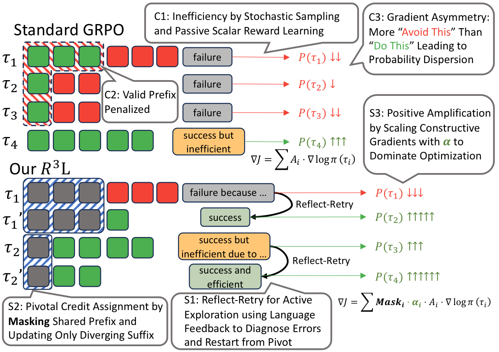
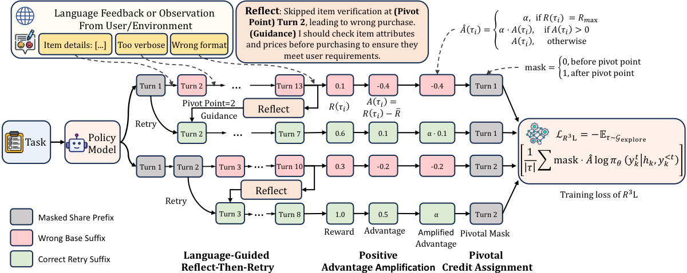

## Abstract

Reinforcement learning drives recent advances in LLM reasoning and agentic capabilities, yet current approaches struggle with both **exploration** and **exploitation**. Exploration suffers from low success rates on difficult tasks and high cost of repeated rollouts from scratch. Exploitation suffers from coarse credit assignment and training instability.

We propose **R³L (Reflect-then-Retry Reinforcement Learning)**, which addresses these challenges through three synergistic components:

1. **Language-Guided Reflect-Then-Retry** synthesizes successful trajectories by diagnosing errors and restarting from identified failure points
2. **Pivotal Credit Assignment** focuses gradient updates on diverging suffixes where contrastive signals exist
3. **Positive Amplification** upweights successful trajectories to ensure positive signals dominate optimization

Experiments demonstrate **5% to 52% relative improvements** over baselines on agentic tasks (ALFWorld, WebShop, ScienceWorld) and mathematical reasoning benchmarks.

---

## Motivation

Standard RL methods like GRPO face three key challenges:

  

| Challenge | Problem | R³L Solution |
|-----------|---------|--------------|
| **C1** | Inefficient exploration with no guidance on failure causes | **S1:** Reflect-Then-Retry with language feedback |
| **C2** | Valid prefixes penalized by trajectory-level rewards | **S2:** Pivotal Credit Assignment on diverging suffixes |
| **C3** | Failed trajectories dominate, causing entropy collapse | **S3:** Positive Amplification (α=3.0) |

---

## Method

  

### Training Objective

$$\mathcal{L}_{\text{R3L}} = -\mathbb{E}\left[\frac{1}{|\tau|} \sum \text{mask} \cdot \hat{A}(\tau) \cdot \log \pi_\theta(y_k^t | h_k, y_k^{<t})\right]$$

Where:
- $$\text{mask}_t = \begin{cases} 0 & \text{if } t < t_{\text{pivot}} \\ 1 & \text{if } t \geq t_{\text{pivot}} \end{cases}$$
- $$\hat{A}(\tau) = \begin{cases} \alpha & \text{if } R(\tau) = R_{\max} \\ \alpha \cdot A(\tau) & \text{if } A(\tau) > 0 \\ A(\tau) & \text{otherwise} \end{cases}$$

### Four Trajectory Types

| Type | Description | Used For |
|------|-------------|----------|
| **Base** | Standard exploration from current policy | RL optimization |
| **Reflection** | Structured diagnosis with pivot point | Auxiliary SFT |
| **Retry** | Generation conditioned on guidance | Auxiliary SFT |
| **Distillation** | Original prefix + corrected suffix | RL optimization |

---

## Experiments

### Environments

| Environment | Task Type | Description |
|-------------|-----------|-------------|
| **ALFWorld** | Embodied | Text-based household tasks |
| **WebShop** | Navigation | E-commerce web navigation |
| **ScienceWorld** | Reasoning | Scientific experiment simulation |
| **GSM8K/MATH** | Math | Mathematical problem solving |

### Main Results

R³L achieves **5-52% relative improvements** over baselines across environments:

- **ALFWorld**: 0.928 vs 0.720 (GRPO baseline) — **+29%**
- **WebShop**: 0.663 vs 0.614 (GRPO baseline) — **+8%**
- **ScienceWorld**: 0.385 vs 0.366 (GRPO baseline) — **+5%**
- **GSM8K**: 0.721 vs 0.474 (GRPO baseline) — **+52%**

---

## Acknowledgements

This work is built on [Trinity-RFT](https://github.com/modelscope/Trinity-RFT). We thank the developers of [ALFWorld](https://github.com/alfworld/alfworld), [ScienceWorld](https://github.com/allenai/ScienceWorld), [WebShop](https://github.com/princeton-nlp/WebShop), and [DAPO](https://github.com/BytedTsinghua-SIA/DAPO) for the evaluation environments and datasets.

